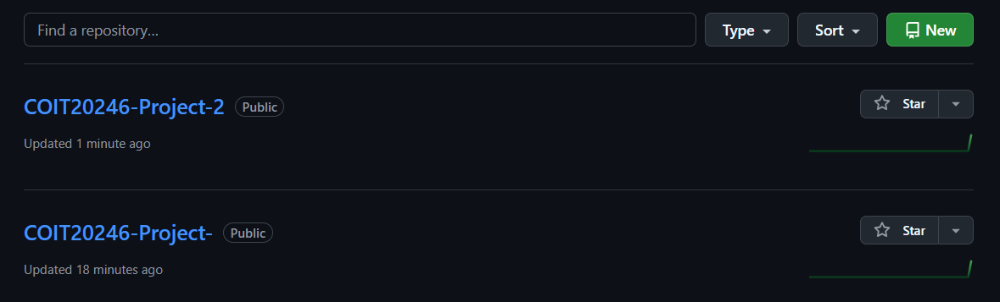

# Project Reflection
This section reflects on the success and challenges in the project and with teamwork.

[GitHub Commits](#github-commits) | [List of Tasks](#list-of-tasks) | [Reflection on Commits and Tasks](#reflection-on-commits-and-tasks) | [Reflection on Group Work](#reflection-on-group-work) | [Plan](./plan.md) | [Network Design](./network.md) | [Cloud Services](./cloud.md) | [Security](./security.md) | [Ethics](./ethics.md) | [Return to index](./README.md)

---

## GitHub Commits
A screenshot showing commits of all team members is included below.

**Commit History Screenshot:**
- File: `./images/github_commits.png`

The commit history demonstrates that both students contributed to the repository through multiple commits during the term. This provides evidence of collaboration and progress over time rather than last-minute submission.

---

## List of Tasks

### Group Members
- **Student 1:** Abhijit Vijesh Chauhan (12318667)
- **Student 2:** Ganga Prashanth Ameti (12317267)

### Actual contribution split
The following table summarises the tasks each student completed and reviewed.

| Project Area / Task | Abhijit Vijesh Chauhan | Ganga Prashanth Ameti |
|---|---|---|
| Repository setup + navigation links | ✅ Completed | Reviewed |
| README.md setup | ✅ Completed | Reviewed |
| plan.md writing (communication + schedule) | ✅ Completed | Reviewed |
| HQ Network Diagram (Sydney) | ✅ Completed | Reviewed |
| Branch Network Diagram (Melbourne) | Reviewed | ✅ Completed |
| Address allocations (67.x.x.x rule compliance) | ✅ Completed | Reviewed |
| Network design write-up + key justifications | ✅ Completed | Assisted |
| WiFi design settings and values | Reviewed | ✅ Completed |
| Hardware list (specs, pricing, links format) | Assisted review | ✅ Completed |
| AWS pricing estimate export | ✅ Completed | Reviewed |
| Azure pricing estimate export | Reviewed | ✅ Completed |
| cloud.md provider comparison + cost writing | ✅ Completed | Assisted |
| Risk assessment spreadsheet (`risk-assessment.xlsx`) | Assisted | ✅ Completed |
| security.md writing (highest-risk asset + 3 controls) | ✅ Completed | Reviewed |
| ethics.md writing (privacy + regulations + impacts) | Reviewed | ✅ Completed |
| Final formatting and proof reading | ✅ Completed | ✅ Completed |

---

## Reflection on Commits and Tasks

### Commit counts
Based on the repository history:

- **Abhijit Vijesh Chauhan:** **[X] commits**
- **Ganga Prashanth Ameti:** **[Y] commits**

*(Replace X and Y with the actual commit counts from GitHub.)*

### Comparison of commits vs contributions
The number of commits does not always directly represent the amount of work completed. In this project:

- Abhijit produced more commits due to completing multiple markdown sections (`network.md`, `cloud.md`, `security.md`) which required frequent incremental updates such as formatting, tables, diagrams linking, and corrections.
- Ganga contributed major deliverables such as the branch diagram, Azure estimate export, ethics writing, and the risk assessment spreadsheet. These tasks typically result in fewer commits because they are completed as larger work packages (e.g., spreadsheets and diagrams are updated in fewer changes).

Overall, the commit history shows that both members made meaningful contributions and supported each other through review and improvements.

### Weekly commit activity
Commits were made over multiple weeks of the term rather than only during the final week.

- Abhijit committed across approximately: **Weeks [__]**
- Ganga committed across approximately: **Weeks [__]**
- Total weeks with commits by the group: **[N] weeks**

This level of commit activity is sufficient, because it demonstrates:
- steady progress
- clear evidence of teamwork
- reduced risk of incomplete tasks near submission

---

## Reflection on Group Work

### What worked well
1. **Clear division of work**
   - Each team member had defined responsibilities (diagrams, cloud pricing exports, spreadsheet, and documentation), reducing duplication and confusion.

2. **Use of templates and consistent formatting**
   - Using the provided markdown templates helped ensure all assessment requirements were addressed systematically.

3. **Continuous review and improvement**
   - Work was reviewed and refined during the project rather than only at the end. This reduced mistakes and improved overall report quality.

4. **GitHub version control**
   - GitHub commits provided traceability of progress and contribution.
   - It also reduced risk, because previous file versions could be restored if needed.

---

### Issues encountered
1. **Cloud pricing complexity**
   - Different cloud calculators present options differently.
   - Ensuring fair comparison across providers required multiple checks of region, VM sizing, and storage settings.

2. **Evidence file management**
   - The project required export files and evidence screenshots to be correctly uploaded and linked.
   - Incorrect naming or broken links could reduce marks, so additional time was spent verifying all references.

3. **Maintaining consistency across files**
   - The same assumptions (branch cities, number of servers, addressing rule) needed to remain consistent across `network.md`, `cloud.md`, and `security.md`.

---

### Recommended techniques for future group projects
Based on techniques used during this project, the following improvements are recommended:

1. **Weekly milestones with task checklist**
   - Helps prevent delays and last-minute work.
   - Ensures steady progress and reduces stress before submission.

2. **Standard naming conventions**
   - Use consistent folder structure such as `diagrams/`, `cloud_estimates/`, `images/`.
   - Prevents missing evidence and broken markdown links.

3. **Peer review before merging major changes**
   - One member reviews the other’s work for quality and rubric compliance.
   - Helps reduce errors (e.g., incorrect region settings or missing justifications).

4. **More frequent small commits**
   - Ensures stronger evidence of contribution.
   - Improves traceability and makes the reflection easier to write.

---

### Conclusion
Overall, the project was completed successfully through structured planning, task sharing, and consistent collaboration. Both members contributed meaningfully to technical outputs (diagrams, cloud pricing exports, spreadsheet risk assessment) and written documentation (network design, cloud services, security controls, ethics). The final submission demonstrates secure network design, cloud evaluation, and professional teamwork supported by GitHub evidence.

---
